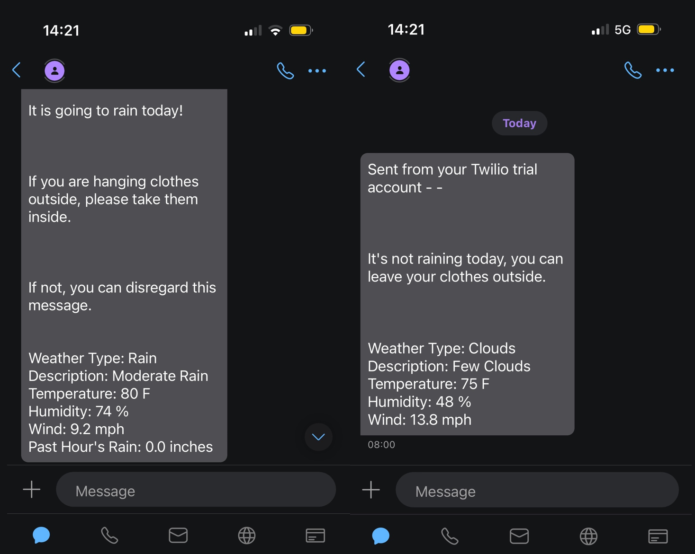

# Dry Clothes Bot

My problem: clothes are hanging outside and weather changes quickly from sunny to rainy. I forget to check the weather in advance sometimes so I have wet clothes when I get home. The idea is to create a bot/app that will check the weather in Taipei and send me an email or text (not sure which one yet) if there is rain or a certain amount of rainfall (inches). The message would say like "Rainy day Take hanging clothes down! with a breakdown of information about the weather for the day.
